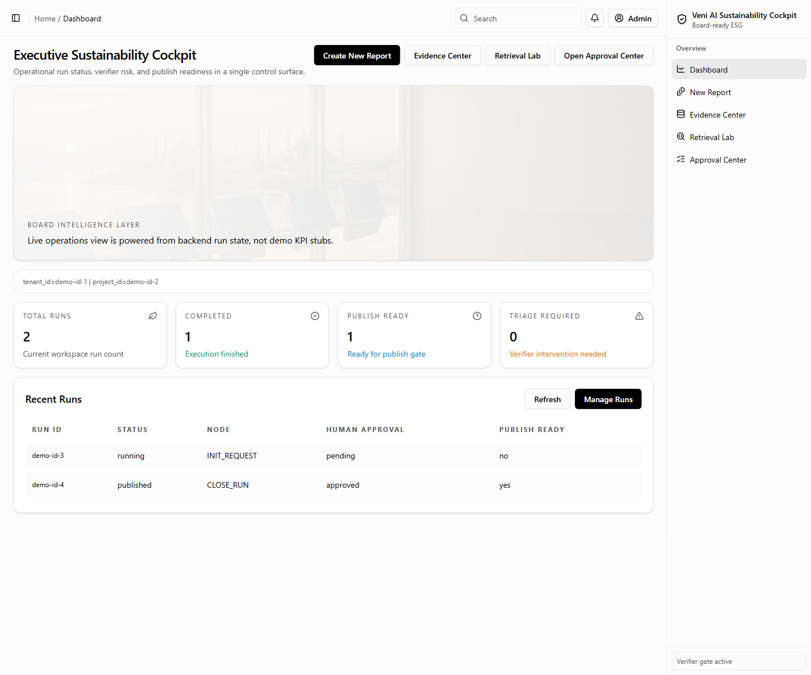
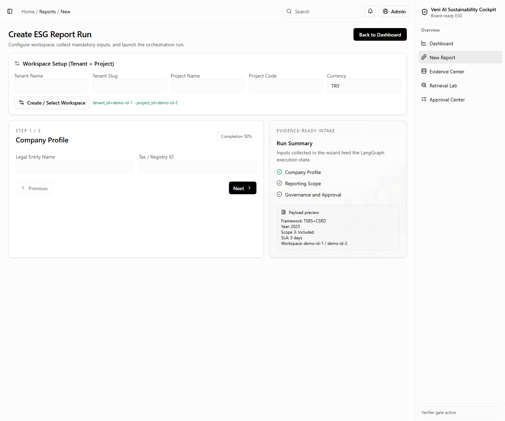
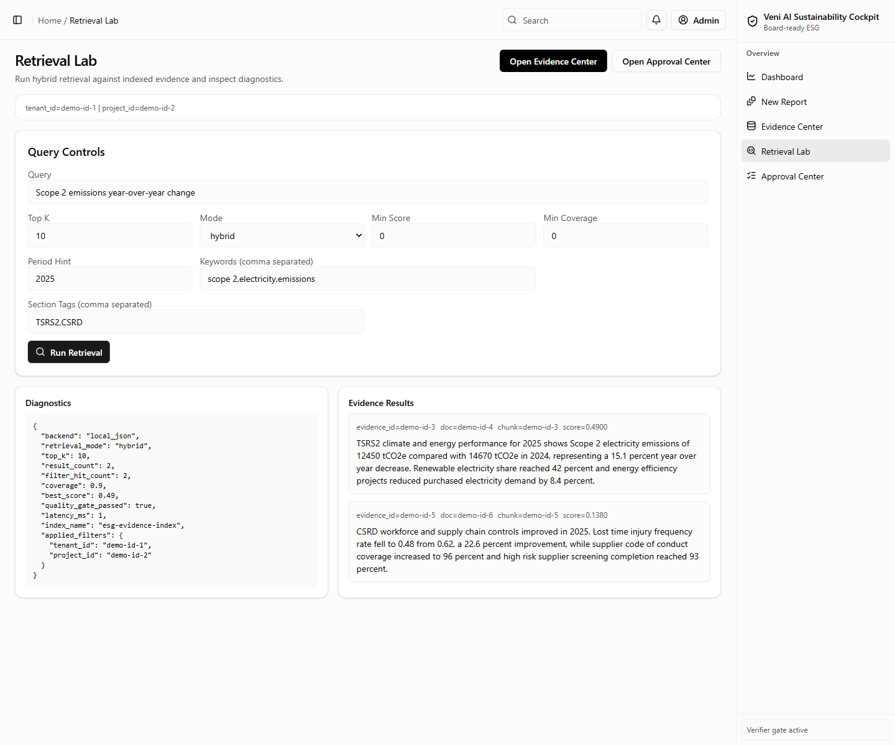
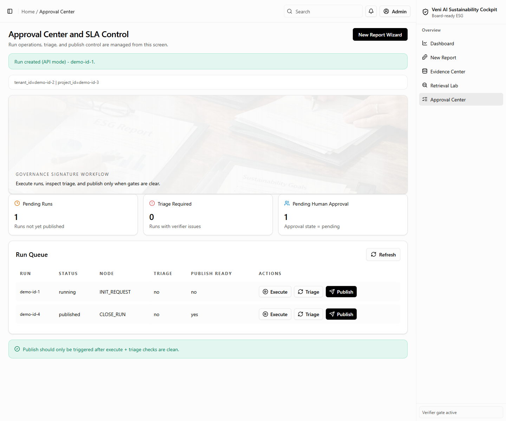
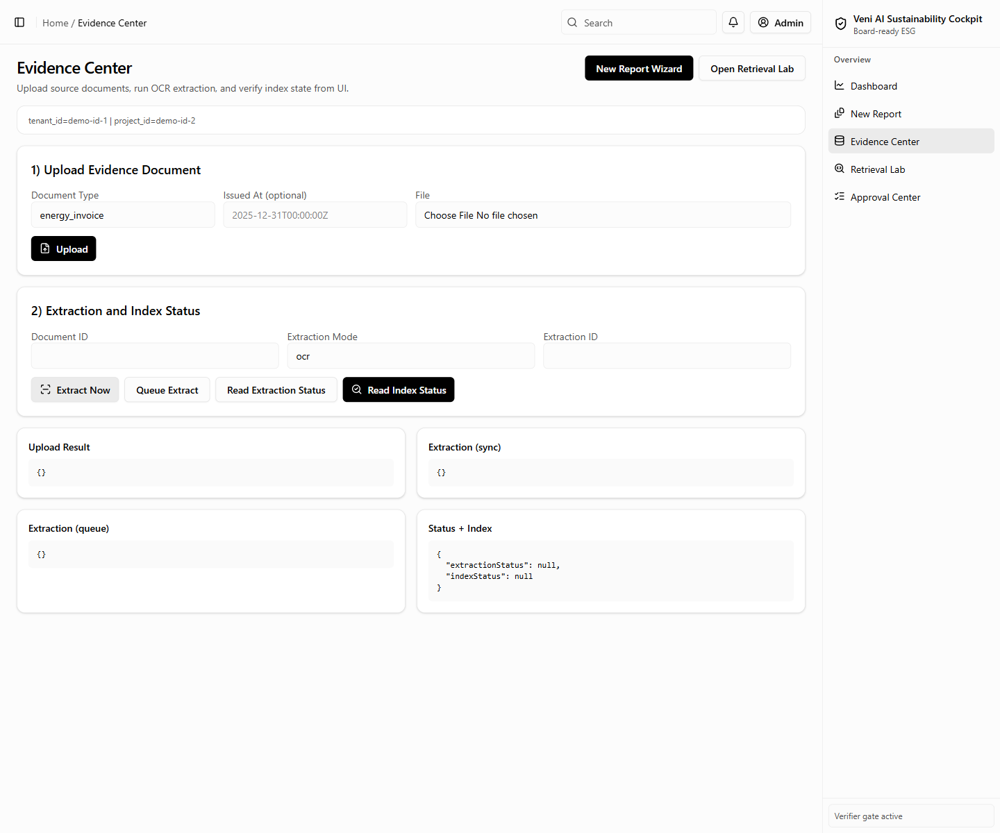
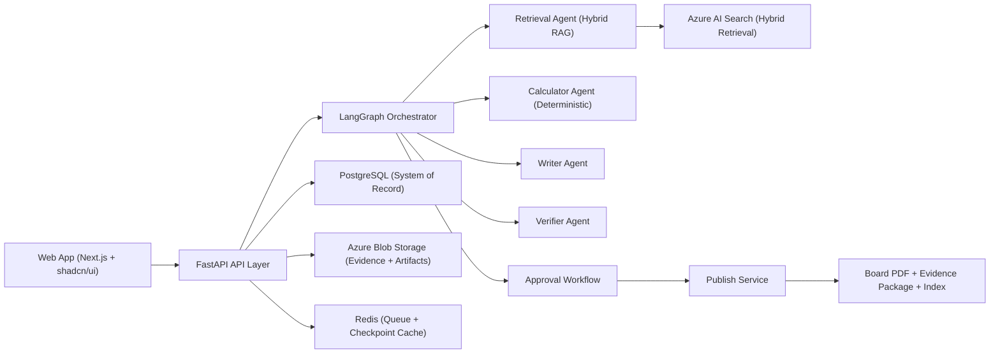

# Veni AI Sustainability Cockpit

Production-grade, multi-tenant B2B SaaS platform for **zero-hallucination sustainability reporting** aligned with **TSRS 1/2** and **CSRD/ESRS**.

[](https://github.com/aliozkanozdurmus/sustainability-project/actions/workflows/ci.yml)


Status: Draft architecture baseline  
Date baseline: 2026-03-10  
Primary documentation set:
- `README.md`
- `AGENTS.md`
- `docs/architecture/public-baseline.md`
- `docs/configuration/runtime-configuration.md`

---

## Product Preview

Current UI screens from the repository:



| Report Builder | Retrieval Lab |
|---|---|
|  |  |

| Approval Center | Evidence Center |
|---|---|
|  |  |

---

## 1) What This Platform Does

This platform lets enterprise teams upload ESG evidence, run deterministic multi-agent generation, and publish audit-ready sustainability report packages with claim-level traceability.

Core promise:
- No evidence, no claim.
- No deterministic calculator artifact, no numeric claim.
- No verifier pass, no publish.

Primary business outcomes:
- Reduce reporting cycle from weeks to days.
- Achieve claim citation coverage at or above 98%.
- Keep numeric consistency at 100% on golden datasets.
- Enable board-ready dashboards and publication-ready PDF outputs.

---

## 2) Target Users

- Sustainability teams (authors and reviewers)
- Finance and risk teams (data owners)
- Internal audit and compliance teams
- External assurance partners (auditor-readonly scope)
- Board and governance committees (approval and sign-off)

---

## 3) Hard Product Rules

- AI policy is locked to **Azure AI Foundry + Azure OpenAI only**.
- Model policy is locked to:
  - `gpt-5.2` (generation + verifier)
  - `text-embedding-3-large` (embeddings)
- Database policy is locked to **Neon PostgreSQL** (`*.neon.tech`).
- Every claim must include citation references.
- Every numeric claim must reference calculator artifacts.
- Verifier statuses are strict: `PASS`, `FAIL`, `UNSURE`.
- Any critical verifier `FAIL` blocks publishing.
- Cross-tenant isolation is mandatory at API, query, and storage layers.

---

## 4) System Architecture (High Level)



---

## 5) Core Technology Baseline

### Frontend
- Next.js App Router + React + TypeScript (strict)
- Tailwind CSS + shadcn/ui + Radix primitives
- ECharts + `echarts-for-react` (production chart stack)
- TanStack Query, Table, Virtual
- `react-hook-form`, `zod`, `@hookform/resolvers`
- `pdfjs-dist` for in-app PDF viewing

### Backend
- Python 3.12+
- FastAPI + Pydantic v2
- SQLAlchemy 2.x + Alembic
- Redis queue/checkpoint cache
- Worker runtime default: `arq` (Celery as exception path)

### AI and Orchestration
- LangGraph for typed state orchestration
- AutoGen for calculator/code-execution-heavy collaboration
- Azure AI Foundry as control plane
- Azure OpenAI as inference provider

### Storage and Search
- PostgreSQL (system of record)
- Azure Blob Storage (raw docs, parsed outputs, report artifacts)
- Azure AI Search (hybrid vector + keyword retrieval)
- Optional non-production fallback: Postgres + pgvector

---

## 6) One-Click Regulatory Generation Pipeline

Single CTA:
- `Generate Regulatory Report Pack`

Execution stages:
1. Applicability resolver
2. Evidence completeness gate
3. Router -> Retrieval -> Calculator -> Writer -> Verifier
4. Regulatory coverage audit
5. Human approval workflow
6. Publish and package

Blocking behavior:
- Critical missing data returns a deterministic `Missing Data Request Pack`.
- Publish is blocked on critical verifier fail, missing citations, or metric integrity issues.

---

## 7) Zero-Hallucination Control Model

### Claim contract
Every generated claim carries:
- `claim_id`
- `statement`
- `evidence_refs[]`
- `confidence`

### Numeric safety
All numeric outputs are generated from deterministic calculations and persisted with:
- input snapshot
- code hash
- output value and unit
- runtime trace log

### Publish gate
Publishing is blocked when:
- any critical claim is `FAIL`
- citation links are missing
- numeric claims lack calculator artifacts
- required policy approvals are incomplete

---

## 8) Data Intake: What We Must Collect

Mandatory intake families:
- Legal and reporting identity
- Regulatory applicability inputs
- Organizational and operational boundaries
- Governance and strategy inputs
- Environmental, social, governance data
- Financial and taxonomy mappings (conditional by scope)
- User run configuration (framework, period, assurance mode, deadline)
- Integration and access metadata (ERP/HR/energy, residency, retention)

Readiness scoring:
- Completeness score
- Evidence quality score
- Traceability score
- Numeric reliability score

Core readiness thresholds:
- Completeness below 85: produce remediation plan instead of final report.
- Numeric reliability below 90 for climate sections: block publish for those sections.

---

## 9) Evidence and KPI Governance

Evidence policy:
- All critical disclosures must map to master-copy evidence artifacts.
- Evidence carries ownership, period coverage, quality score, and checksum.
- Missing critical evidence deterministically blocks generation.

KPI quality policy:
- KPI datasets include schema, source, freshness, owner, quality grade, and verification rules.
- Quality grades map to score bands (`A`, `A-`, `B+`, `B`, `C+`, `<70`).
- Critical claims require high-grade evidence unless an approved exception exists.

---

## 10) Double Materiality Standard

Decision axes:
- Financial materiality (outside-in)
- Impact materiality (inside-out)

Method:
1. Stakeholder input collection
2. 5x5 likelihood-impact scoring
3. Matrix generation and ranking
4. Committee review and board approval

Governance rules:
- Threshold sets are tenant-configurable but approval-controlled.
- Matrix versions are immutable after approval.
- Any post-approval change triggers re-approval.

---

## 11) Approval Workflow and SLA Governance

Approval hierarchy:
- Sustainability committee approves draft readiness.
- Governance committee performs pre-board review.
- Board is final signature authority.

State machine:
- `Drafting`
- `PendingDomainApproval`
- `PendingCommitteeApproval`
- `PendingGovernanceApproval`
- `PendingBoardApproval`
- `ApprovedForPublish`
- `RejectedForRevision`
- `Overdue`
- `Published`

SLA automation:
- Reminder at T-48h and T-24h.
- Overdue status triggers escalation chain.
- No report can publish without board-level final approval record.

---

## 12) Dashboard and PDF Publication Standard

Mandatory board dashboard visuals:
- Double materiality matrix
- Scope 1/2/3 trend with target overlay
- ESG risk and opportunity matrix
- E/S strategic KPI cockpit
- Workflow and SLA progress panel

Final PDF sequence:
1. Cover page
2. Interactive table of contents
3. Chair/CEO message
4. Corporate profile and value chain
5. Governance and sustainability strategy
6. Double materiality analysis
7. ESG disclosures
8. Forward-looking targets and action plan
9. Framework index tables
10. Appendices (assumptions, methodology, calculation and evidence refs)

PDF must support:
- clickable bookmarks and ToC
- claim-to-evidence navigation
- framework index with disclosure code, page, verifier status
- merged final package with consistent numbering and metadata

---

## 13) PDF Library Stack (Locked)

Backend:
- `pymupdf`
- `pypdf`
- `pdfplumber`
- `pikepdf`
- `reportlab`
- `weasyprint`
- `pyhanko` (recommended for digital signatures)

OCR and document AI:
- Azure AI Document Intelligence (default production OCR path)
- `ocrmypdf` only as controlled exception path

Frontend:
- `pdf.js` / `pdfjs-dist` compatible viewer

---

## 14) Product IA and Page Map

Planned product inventory:
- Core app pages: 32
- Shared/system pages: 6
- Total core product pages: 38
- Optional marketing pages: 4 (total 42 if included)

Key route groups:
- Auth
- Onboarding
- Dashboard
- Projects (`/app/projects/[projectId]/*`)
- Settings
- Approval and board-pack flow

Example critical pages:
- `/app/dashboard/executive`
- `/app/dashboard/board-cockpit`
- `/app/projects/new/wizard`
- `/app/projects/[projectId]/data-room`
- `/app/projects/[projectId]/verification-center`
- `/app/projects/[projectId]/approvals`
- `/app/projects/[projectId]/publish`
- `/app/projects/[projectId]/filing-index`

Role visibility includes:
- `admin`
- `compliance_manager`
- `analyst`
- `board_member`
- `committee_secretary`
- `auditor_readonly`

---

## 15) End-to-End User Scenarios

Primary journey:
1. User lands on executive dashboard.
2. User opens new report wizard.
3. Wizard collects identity, scope, boundaries, integrations, evidence, materiality, approval routing.
4. User starts one-click generation.
5. System runs applicability, completeness, orchestration, verifier, coverage audit.
6. User resolves FAIL/UNSURE in verification center.
7. Assurance room validates traceability package.
8. Approval chain executes with SLA monitoring and escalation.
9. Board sign-off completes.
10. Publish and filing index export complete.

Non-happy path examples:
- Missing critical evidence triggers remediation pack and blocks generation.
- Approval SLA breaches trigger reminders/escalation and block progression.

---

## 16) Production Monorepo Contract

Planned top-level structure:

```text
/
  apps/
    web/
    api/
  services/
    worker/
  packages/
    shared-types/
    ui/
    config/
  infra/
    docker/
    terraform/
  .github/workflows/
  docs/
  turbo.json
  pnpm-workspace.yaml
  knip.json
  vercel.json
  docs/configuration/
```

Required production config files include:
- Dockerfiles for web, api, worker
- Compose files for baseline/dev/observability profiles
- `vercel.json`
- `knip.json`
- `turbo.json`
- `pnpm-workspace.yaml`
- CI/CD workflows for PR gates and deployments

---

## 17) Containerization, CI/CD, and Runtime Operations

Container standards:
- multi-stage builds
- minimal runtime images
- non-root users
- health checks
- scan images in CI

CI pipeline baseline:
- JS/TS typecheck, lint, test, knip
- Python lint, typecheck, test
- contract drift checks
- security and dependency scans

CD baseline:
- Web deploy to Vercel
- API/worker deploy to Azure runtime
- migration job execution
- post-deploy health verification

---

## 18) Security, Reliability, and Governance Program

Security foundations:
- SSO/OIDC
- RBAC and row-level tenant isolation
- encryption in transit and at rest
- managed identity + Key Vault
- immutable audit trails

Reliability and continuity:
- BCP/DR with RTO/RPO tiers
- incident response severity model and postmortems
- SLO/SLA + error budget controls
- release governance with rollback readiness

Assurance readiness:
- auditor-readonly workspaces
- one-click evidence export with integrity hash
- claim-citation-verification matrix and approval timeline preservation

---

## 19) Regulatory Scope and Change Management

Jurisdiction register:
- Türkiye TSRS logic with threshold and transition relief versioning
- EU CSRD/ESRS scope logic with legal snapshot dating and cohort handling

System requirement:
- scope engine outputs must be versioned, explainable, and reproducible.

Regulation timeline handling:
- runs are pinned to `reg_pack_version` and `legal_snapshot_date`
- legal updates trigger change alerts and re-validation prompts

---

## 20) Package Matrix and Dependency Governance

Dependency policy:
- Required, Recommended, and Optional package tiers are defined in `docs/architecture/public-baseline.md`.
- Major versions are pinned before implementation phases.
- Any package change requires architecture approval and ADR update.

Important lock-ins:
- Single production chart stack: ECharts
- Single production CSS system: Tailwind + shadcn/ui
- Azure-only model inference endpoints

---

## 21) Premium UI and Motion Standard

UI objective:
- "Calm surface, dense intelligence."

Design and motion requirements:
- token-driven semantic colors
- board-grade information hierarchy
- meaningful motion only (state/progress clarity)
- reduced-motion support and WCAG 2.2 AA alignment
- dashboard performance targets (LCP, INP, CLS) enforced in staging

---

## 22) Quality Gates and Definition of Done

A report run is done only when:
- scope/applicability approved
- completeness and quality thresholds satisfied
- required metrics reproducible
- claims citation-backed
- critical verifier FAIL count is zero
- approval workflow completed
- final package exported
- archive and traceability checks passed

---

## 23) Phased Delivery Roadmap

- Phase -1: Architecture freeze
- Phase 0: Foundation and regulatory mapping
- Phase 1: Platform skeleton
- Phase 2: Ingestion and storage backbone
- Phase 3: Hybrid retrieval engine
- Phase 4: LangGraph state orchestration
- Phase 5: Agent layer
- Phase 6: Reviewer UX and publish workflow
- Phase 7: Hardening and pilot

No implementation should proceed without architecture freeze sign-off.

---

## 24) Recommended Local Development Workflow

1. Review `docs/architecture/public-baseline.md` and `AGENTS.md`.
2. Validate architecture freeze checklist before coding.
3. Run service-level quality gates:
- web: lint, typecheck, tests
- api: lint, typecheck, tests, migration checks
- worker: job tests and integration checks
4. Validate cross-service contracts before merge.
5. Use phase-gated delivery and acceptance criteria per task.

---

## 25) Repository Source of Truth

Core planning docs:
- `README.md` for product scope, stack, and repository map.
- `docs/architecture/public-baseline.md` for architecture, governance, and package policy.
- `AGENTS.md` for multi-agent contracts, state interfaces, and verifier gates.
- `docs/configuration/runtime-configuration.md` for runtime variables without versioned secret files.

If these documents diverge:
- `AGENTS.md` governs agent contracts and publish gates.
- `docs/architecture/public-baseline.md` governs architecture and package policy.
- `docs/configuration/runtime-configuration.md` governs the public runtime variable catalog.
